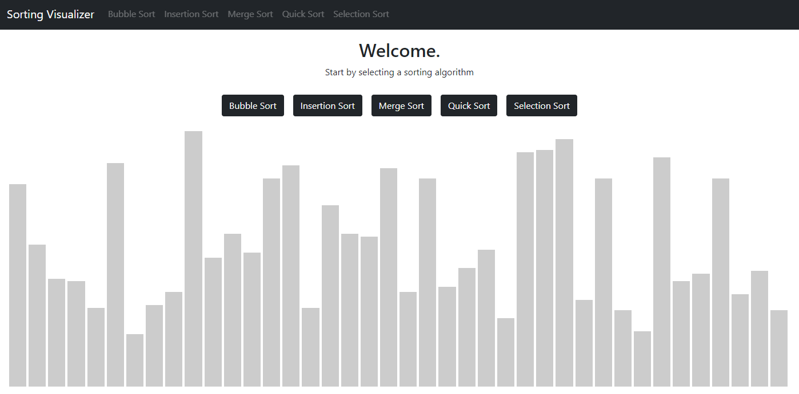
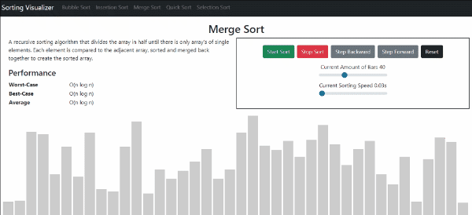

# Sorting Visualizer

This sorting visualizer offers users the ability to see the various sorting algorithms in action.

## Demo

https://chatic.timkrause.dev/

## Features

- **Algoritms**: Explore the visual representation of five different sorting algorithms: Bubble, Insertion, Merge, Quick and Selector Sort
- **Step Through Time**: Navigate through the steps of the algorithm's process, advancing or reversing to observe the movements in action
- **Settings**: Control the number of bars being sorted and the speed of sorting with adjustable settings

## Screenshots

## Tech Stack

**Client:** React, Boostrap, SCSS

## Contact
If you have any questions about my work or if you have any opportunities you think I would be a good fit for, please [contact me](mailto:timkrausedev@gmail.com).
